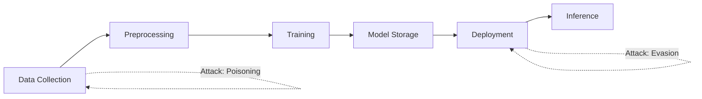

# Challenge 2: Build Your Attack Surface Map

**Time Estimate**: 1.5 hours  
**Difficulty**: Beginner  
**Deliverable**: `week-1/attack_surface_map.png` + `week-1/attack_surface_map.md`

## Objective

Create a visual map of ML system attack surfaces. This exercise helps you think like a red teamer by identifying all potential entry points in an ML pipeline.

## Why This Matters

In traditional pentesting, you map application attack surfaces (APIs, authentication, data storage). In AI red teaming, you map ML pipeline attack surfaces (data collection, training, deployment, inference). This visual exercise builds that mapping skill.

## Your Task

### Step 1: Draw the ML Pipeline (30 min)

Create a diagram showing a complete ML system pipeline:

Data Collection → Preprocessing → Training → Model Storage → Deployment → Inference

For each stage, include:
- **Inputs**: What data/artifacts enter this stage?
- **Processes**: What happens in this stage?
- **Outputs**: What data/artifacts exit this stage?
- **Stakeholders**: Who has access at this stage?

### Step 2: Identify Attack Vectors (30 min)

For each pipeline stage, identify:
- **Attack Vectors**: How could an attacker compromise this stage?
- **Threat Actors**: Who might attack (internal, external, nation-state)?
- **Attack Goals**: What could attackers achieve (data theft, model corruption, evasion)?
- **Vulnerabilities**: What weaknesses exist?

### Step 3: Annotate Your Map (30 min)

Add annotations to your diagram:
- Color-code by attack type (evasion, inference, poisoning)
- Mark high-risk stages
- Note potential defensive controls
- Link to OWASP ML Top 10 items

## Tools You Can Use

**Option 1: Mermaid (Text-based, version-controllable)**

**Option 2: draw.io (Visual, easy to use)**
- Export as PNG or SVG
- Easy to add annotations and colors

**Option 3: PlantUML (Code-based diagrams)**
- Good for structured pipelines

**Option 4: Simple Markdown + ASCII art**
- Works if you prefer text-based

## Deliverable Structure

### Visual Map (`attack_surface_map.png` or `.svg`)
Your diagram should include:
- Complete ML pipeline flow
- Attack vectors marked on each stage
- Color-coding or symbols for different attack types
- High-risk areas highlighted

### Written Explanation (`attack_surface_map.md`)

# ML Pipeline Attack Surface Map

## Pipeline Overview
[Describe your pipeline architecture]

## Stage-by-Stage Analysis

### 1. Data Collection
**Attack Vectors:**
- [List potential attacks]

**Threat Actors:**
- [Who could attack]

**Defensive Controls:**
- [What mitigations exist]

### 2. Preprocessing
[... repeat for each stage]

## Risk Prioritization
[Which stages are highest risk? Why?]

## OWASP ML Top 10 Mapping
[Which vulnerabilities apply to which stages?]

## Red Team Testing Strategy
[How would you test this pipeline?]

## Example Attack Vectors by Stage

**Data Collection:**
- Data poisoning (inject malicious samples)
- Data theft (steal training data)
- Data manipulation (modify data labels)

**Training:**
- Model poisoning (corrupt training process)
- Hyperparameter manipulation
- Training data extraction

**Model Storage:**
- Model theft (extract model weights)
- Backdoor insertion
- Model corruption

**Deployment:**
- API endpoint enumeration
- Input validation bypass
- Rate limiting evasion

**Inference:**
- Adversarial examples (evasion)
- Membership inference
- Model extraction via queries

## Success Criteria

Your attack surface map should:
- Include all 5-6 major pipeline stages
- Identify at least 2 attack vectors per stage
- Link attacks to specific OWASP ML Top 10 items
- Demonstrate understanding of red team perspective

## Portfolio Note

This map will be useful for:
- Client engagements (showing comprehensive understanding)
- Portfolio demonstration of security thinking
- Reference for future attack planning

## Next Steps

After creating your map:
- Keep it updated as you learn new attack techniques
- Use it to plan attack strategies in later weeks
- Compare with actual client systems (in future engagements)

