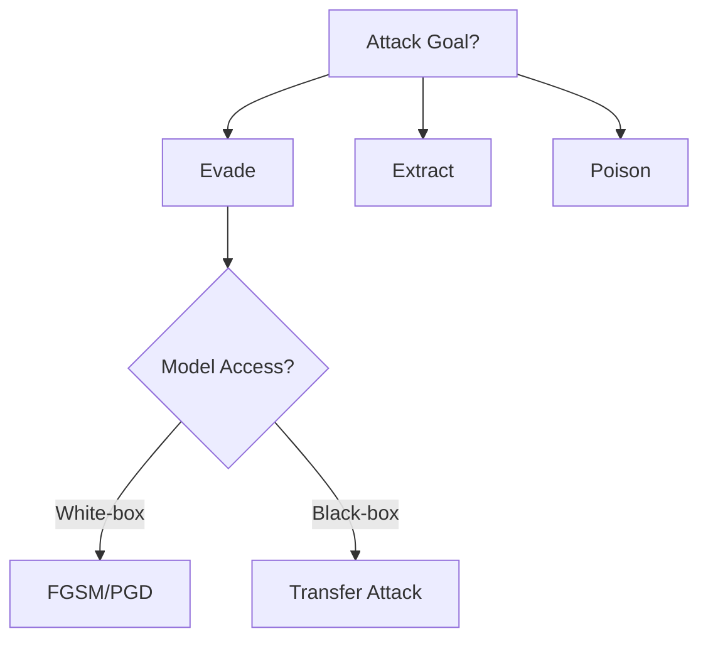

# Challenge 2: Attack Taxonomy Decision Tree

**Time Estimate**: 1 hour  
**Difficulty**: Beginner  
**Deliverable**: `week-2/attack_decision_tree.md` or `.png`

## Objective

Create a visual decision tree that helps you choose which attack to use based on your situation. This builds tactical decision-making skills for real engagements.

## Why This Matters

In real engagements, you need to quickly decide:
- Which attack fits this scenario?
- What do I have access to?
- What's my goal?
- What's the most efficient approach?

A decision tree helps you make these choices systematically.

## Decision Points

Your tree should help answer: "Which attack should I use?"

**Key Decision Factors**:
1. **Model Access**: White-box (full access) vs Black-box (API only)
2. **Data Access**: Training data available vs not available
3. **Attack Goal**: Evade, Extract, or Poison
4. **Time Constraints**: Fast attack vs thorough attack
5. **Stealth Requirements**: Need to avoid detection vs can be obvious

## Tree Structure

Start with the root question: **"What's your attack goal?"**

```
                    What's your goal?
                   /      |       \
              Evade    Extract   Poison
```

Then branch based on access:

```
                    Evade
                   /      \
            White-box   Black-box
             /    \         /    \
        FGSM   PGD     Transfer  Query
```

Continue branching for each decision point.

## Your Task

### Step 1: Design the Tree (30 min)

Create a decision tree covering:
- **Evasion Attacks**: When to use FGSM, PGD, transfer attacks
- **Inference Attacks**: When to use membership inference, model extraction
- **Poisoning Attacks**: When to use data poisoning, backdoor attacks

**Decision Criteria to Include**:
- Model access level
- Training data availability
- Attack time constraints
- Stealth requirements
- Attack success rate needed

### Step 2: Create Visual Representation (20 min)

Use one of these tools:

**Option 1: Mermaid (Recommended - Version Control Friendly)**


**Option 2: draw.io**
- Visual editor, easy to use
- Export as PNG or SVG

**Option 3: PlantUML**
- Code-based, good for complex trees

**Option 4: Simple Text/ASCII**
- Works if you prefer text-based

### Step 3: Add Details (10 min)

For each leaf node (final decision), add:
- Attack name
- When to use it
- Success rate expectation
- Time required
- Tools needed

## Deliverable Structure

### Visual Tree (`attack_decision_tree.png` or `.md` with Mermaid)

Your tree should show:
- Clear decision points
- All three attack categories (evasion, inference, poisoning)
- Access level considerations
- Tool recommendations

### Written Guide (`attack_decision_tree.md`)

```markdown
# Attack Taxonomy Decision Tree

## Overview
[Brief explanation of the decision tree]

## How to Use
[Step-by-step guide on using the tree]

## Decision Tree
[Embed or link to visual tree]

## Attack Details

### Evasion Attacks
#### FGSM
- **When to use**: [Situations]
- **Requirements**: [Access, tools needed]
- **Success rate**: [Expected]
- **Time**: [How long]

#### PGD
- **When to use**: [Situations]
- **Requirements**: [Access, tools needed]
- **Success rate**: [Expected]
- **Time**: [How long]

[Continue for each attack...]

### Inference Attacks
[Similar structure]

### Poisoning Attacks
[Similar structure]

## Real-World Scenarios

### Scenario 1: Black-Box API, Need to Evade
**Path through tree**: [Describe path]
**Selected attack**: [Attack chosen]
**Rationale**: [Why this attack]

### Scenario 2: White-Box Model, Extract Training Data
**Path through tree**: [Describe path]
**Selected attack**: [Attack chosen]
**Rationale**: [Why this attack]

[Add 3-5 scenarios]

## Quick Reference

| Situation | Recommended Attack | Why |
|-----------|-------------------|-----|
| Black-box evasion | Transfer attack | No model access needed |
| White-box evasion | PGD | Highest success rate |
| Membership leak test | Membership inference | Detects training data leakage |

## Notes
[Any special considerations, edge cases, etc.]
```

## Example Decision Path

**Scenario**: "I have API access to a fraud detection model. I want to bypass it."

**Decision Path**:
1. Goal? → **Evade**
2. Access? → **Black-box** (API only)
3. Training data? → **No**
4. Time? → **Fast needed**
5. Result: → **Transfer Attack** or **Query-based Evasion**

## Success Criteria

Your decision tree should:
- Cover all three attack categories
- Include at least 4-5 decision points
- Lead to specific attack recommendations
- Include practical guidance (tools, time, success rates)
- Be usable as a quick reference

## Real-World Application

Use this tree:
- Before starting engagements (attack planning)
- During engagements (quick decision making)
- In reports (explain attack selection rationale)
- For training (teach others attack selection)

## Extension Challenge

After creating the basic tree:
- Add more sophisticated branches (attack combinations, chained attacks)
- Include defense-aware decision points
- Add cost/benefit analysis (attack effort vs expected success)
- Create scenario-based quick guides

## Next Steps

- Keep tree updated as you learn new attacks
- Use it to plan Week 3-6 attacks
- Reference in vulnerability reports
- Share with peers for feedback (if collaborative)

